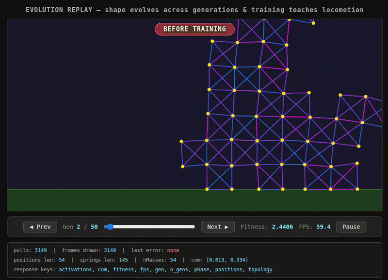
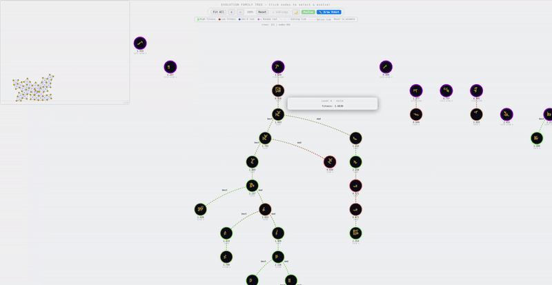
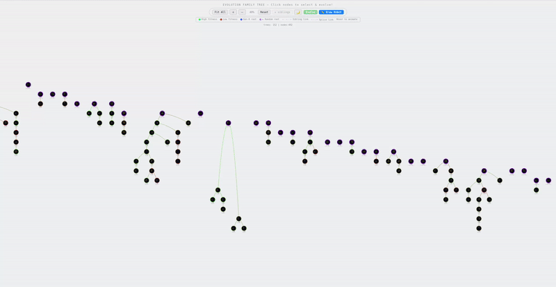
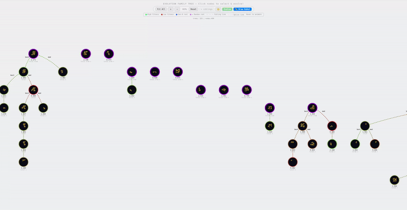
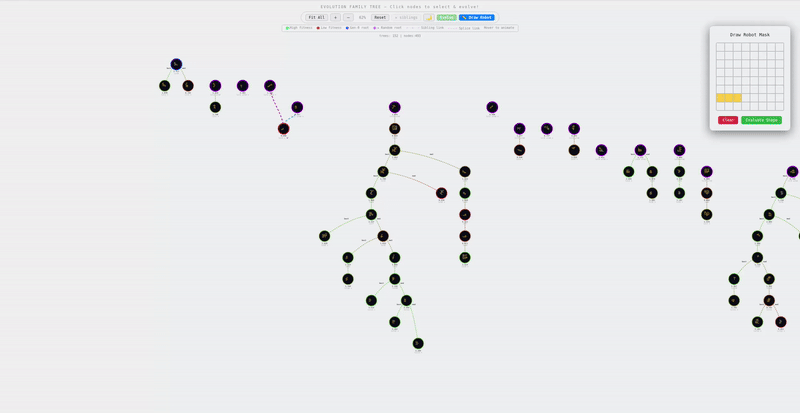
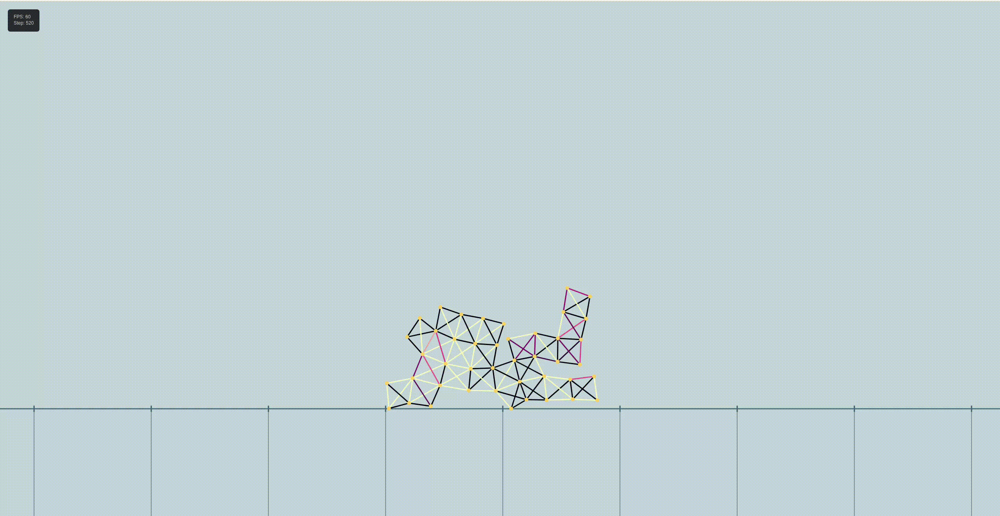
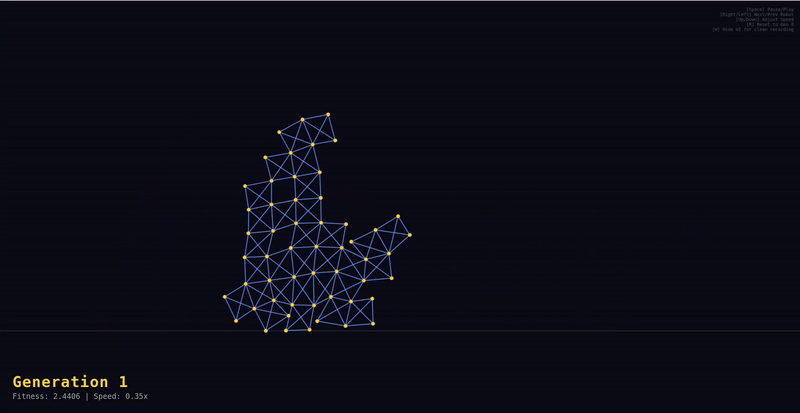

# ALife-Sim: Interactive Evolutionary Robotics

## Overview
This repository provides a physical simulation platform for studying the automatic design of robots and virtual creatures. Originally based on concepts from *[Evolution and learning in differentiable robots](https://sites.google.com/view/eldir)*, this project has been heavily expanded into a **fully interactive Artificial Life sandbox**.

By abstracting away the heavy Taichi physical simulation and control optimization details, this codebase utilizes an Age-Fitness Pareto Optimization (AFPO) algorithm to evolve 8x8 voxel-based robots. It features a suite of custom-built web visualizers that allow you to track genetic lineages, manually intervene in the evolutionary process, and design creatures by hand.

## Key Features

### Advanced Evolutionary Engine (`afpo_run.py`)
* **Age-Fitness Pareto Optimization (AFPO):** Overhauled the base simulation to use a multi-objective optimization algorithm, preventing premature convergence by protecting young, novel morphologies while culling stagnant ones.
* **Deep Lineage Tracking:** Serializes the entire evolutionary history into a structured `lineage.json` DAG (Directed Acyclic Graph), perfectly preserving parent-child relationships, exact generation levels, and tracking sibling competitions within litters.

---

### Interactive Evolution Tree Visualizer

A custom-built Flask backend and HTML5 Canvas frontend to explore the evolutionary data in real-time.

* **Dynamic Family Trees:** Renders the complex genetic lineage of your robots. Includes smart layout algorithms with collision avoidance to clearly display biological branches, sibling links, and crossover DAG paths.
* **Hover-to-Animate:** Hovering over any node on the tree instantly plays a local, high-framerate playback of that specific robot's locomotion and physics performance.
* **Customizable UI:** Features a dynamic Light/Dark mode toggle, smooth pan/zoom camera controls, and high-contrast fitness color mapping.



---

### Hover-to-Animate Node Playback

Hover over any node in the lineage tree to instantly preview that robot's learned locomotion gait — no page navigation required.



---

### Sandbox Mode: Forced Evolution (Targeted Mutation)

Select any robot on the tree and hit **Evolve** to instantly mutate its DNA, evaluate its new morphology in Taichi, and append the child to the live tree.



---

### Sandbox Mode: Spatial Splicing (Crossover)

Select two different robots and hit **Splice**. The engine cleanly slices their physical masks, merges them together, recalculates connectivity, and evaluates the new hybrid baby.



---

### Manual Robot Drawer

Open the interactive 8x8 pixel grid, manually paint the physical "flesh" structure of a custom robot, and push it directly into the simulation environment to see if your design can walk.



---

### Best Robot Visualizer

A dedicated viewer that isolates and replays the champion robot from your evolutionary run, showing its full learned locomotion in a clean, full-screen display.



---

### Cinematic Evolution Montage Viewer (`evolution_visualizer.py`)

A dedicated, full-screen playback tool designed for capturing video montages of the evolutionary process.

* Automatically extracts the #1 Champion robot from every generation.
* For each generation, shows a **before-training** phase (random control network) followed by an **after-training** phase (learned gait), illustrating the power of the optimizer.
* Includes keyboard controls for variable playback speed (down to `0.1x` slow-motion), generation skipping, and UI hiding for clean screen recording.



---

## Installation

1. Install [Miniconda](https://www.anaconda.com/docs/getting-started/miniconda/main) if you do not already have it.
2. Create a new environment:
   ```bash
   conda create --name alife-sim
   ```
3. Activate the environment:
   ```bash
   conda activate alife-sim
   ```
4. Install Python 3.12:
   ```bash
   conda install python=3.12
   ```
5. Install the Taichi physics engine:
   ```bash
   pip install taichi==1.7.3
   ```
6. Install required dependencies:
   ```bash
   pip install tqdm scipy pyaml flask ipykernel matplotlib
   ```

---

## Usage Guide

### 1. Run the Evolution Engine

To start evolving robots from scratch, run the AFPO simulation. This generates `lineage.json` and per-generation snapshots in `evolution_snapshots/`.

```bash
python afpo_run.py --config config.yaml --generations 20
```

> Adjust simulation parameters like population size (`n_sims`), evaluation time (`learning_steps`), and mutation rates inside `config.yaml`.

### 2. Launch the Interactive Sandbox

Once you have a `lineage.json` file, launch the Flask web server to explore and interact with your evolution tree.

```bash
python tree_visualizer.py
```

Open your browser to `http://localhost:5001`. From here you can:
- Hover nodes to preview robot locomotion
- Click a node and hit **Evolve** to mutate it
- Select two nodes and hit **Splice** to crossover their morphologies
- Open the **Draw** panel to paint a custom robot by hand

### 3. View the Best Robot

To replay the champion robot from your run:

```bash
python visualizer.py
```

Open your browser to `http://localhost:5000`.

### 4. Record an Evolution Montage

To watch the champions evolve across generations in a clean, full-screen loop (ideal for OBS or screen recording):

```bash
python evolution_visualizer.py --config config.yaml
```

Open your browser to `http://localhost:5002` and press `F11` for full screen.

| Key | Action |
|-----|--------|
| `Spacebar` | Pause / Play |
| `Left / Right` | Skip generations |
| `Up / Down` | Adjust playback speed |
| `R` | Reset to Generation 0 |
| `H` | Hide all UI elements |
